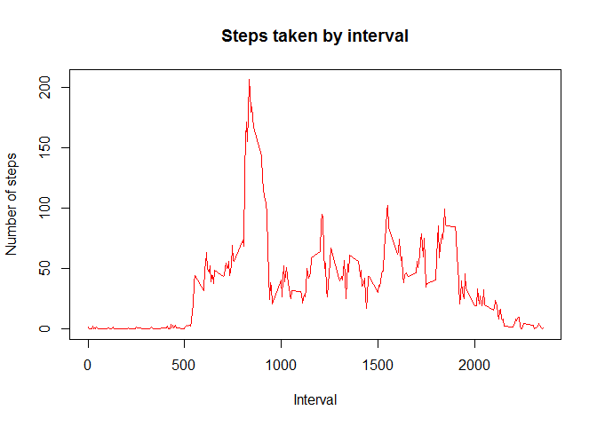
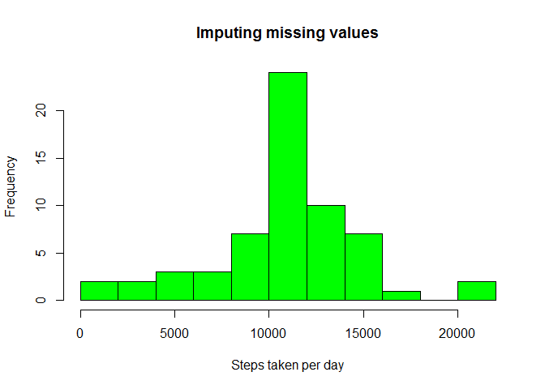
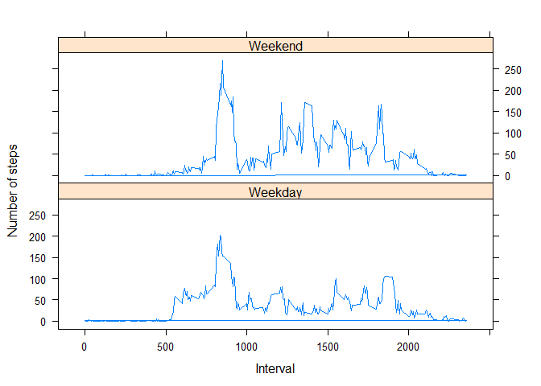

# Reproducible Research: Peer Assessment 1
Patricio Moreno  
October 8, 2015  


### Loading and preprocessing the data

*First, loading some libraries here.*

```r
library(dplyr)
library(tidyr)
```
Show any code that is needed to:

* Load the data

*Reading the data, creating a data frame table*

```r
act <- read.csv("activity.csv")
act <- tbl_df(act)
act
```

```
## Source: local data frame [17,568 x 3]
## 
##    steps       date interval
##    (int)     (fctr)    (int)
## 1     NA 2012-10-01        0
## 2     NA 2012-10-01        5
## 3     NA 2012-10-01       10
## 4     NA 2012-10-01       15
## 5     NA 2012-10-01       20
## 6     NA 2012-10-01       25
## 7     NA 2012-10-01       30
## 8     NA 2012-10-01       35
## 9     NA 2012-10-01       40
## 10    NA 2012-10-01       45
## ..   ...        ...      ...
```

* Process/transform the data (if necessary) into a format suitable for your analysis

*Preprocessing: group data by Date and then summarize, to show the total of steps per day.*

```r
act_date <- act %>%
  group_by(date) %>%
  summarize(steps_day=sum(steps))
```

*Preprocessing: Removing NA's*

```r
act2 <- act_date %>%
  filter(!is.na(steps_day)) ## Remove NA values
```

### What is mean total number of steps taken per day?

For this part of the assignment, you can ignore the missing values in the dataset.

1. Calculate the total number of steps taken per day

```r
act_date
```

```
## Source: local data frame [61 x 2]
## 
##          date steps_day
##        (fctr)     (int)
## 1  2012-10-01        NA
## 2  2012-10-02       126
## 3  2012-10-03     11352
## 4  2012-10-04     12116
## 5  2012-10-05     13294
## 6  2012-10-06     15420
## 7  2012-10-07     11015
## 8  2012-10-08        NA
## 9  2012-10-09     12811
## 10 2012-10-10      9900
## ..        ...       ...
```

2. If you do not understand the difference between a histogram and a barplot, research the difference between them. Make a histogram of the total number of steps taken each day


```r
hist(act2$steps_day, main="Histogram of total number of steps taken per day", 
     xlab="Steps taken per day", ylab="Frequency", breaks=10, col="green")
```

 

3. Calculate and report the mean and median of the total number of steps taken per day


```r
mean(act2$steps_day)
```

```
## [1] 10766.19
```

```r
median(act2$steps_day)
```

```
## [1] 10765
```


### What is the average daily activity pattern?

1. Make a time series plot (i.e. type = "l") of the 5-minute interval (x-axis) and the average number of steps taken, averaged across all days (y-axis)

*Grouping the data by intervals, and then summarizing.*

```r
act_int <- act %>%
  group_by(interval) %>%
  summarize(mean_steps=mean(steps, na.rm=TRUE))
```

*Making the plot.*

```r
plot(act_int$interval,act_int$mean_steps,type="l", col="red" , 
     main = "Steps taken by interval", xlab = "Interval", 
     ylab = "Number of steps")
```

 

2. Which 5-minute interval, on average across all the days in the dataset, contains the maximum number of steps?
  

```r
filter(act_int, mean_steps==max(mean_steps))
```

```
## Source: local data frame [1 x 2]
## 
##   interval mean_steps
##      (int)      (dbl)
## 1      835   206.1698
```


### Imputing missing values


1. Calculate and report the total number of missing values in the dataset (i.e. the total number of rows with NAs)


```r
act_na <- act %>%
  filter(is.na(steps))
nrow(act_na)
```

```
## [1] 2304
```

2. Devise a strategy for filling in all of the missing values in the dataset. The strategy does not need to be sophisticated. For example, you could use the mean/median for that day, or the mean for that 5-minute interval, etc.

*I decided to fill the missing values using the mean for each 5-minute interval, rounding the value (to deal with decimal digits) with the function round.*

```r
act_nona <- act %>%
  filter(!is.na(steps))

act_int2 <- act_int %>%
  mutate(steps=as.integer(round(mean_steps))) %>%
  select(interval,steps)

a <- complete(act_na, fill=act_int2, by=steps)
```

3. Create a new dataset that is equal to the original dataset but with the missing data filled in.


```r
act3 <- rbind(act_nona, a)
act3 <- arrange(act3,date,interval)

act3 <- act3 %>%
  group_by(date) %>%
  summarize(steps_day=sum(steps))

act3
```

```
## Source: local data frame [61 x 2]
## 
##          date steps_day
##        (fctr)     (int)
## 1  2012-10-01     10762
## 2  2012-10-02       126
## 3  2012-10-03     11352
## 4  2012-10-04     12116
## 5  2012-10-05     13294
## 6  2012-10-06     15420
## 7  2012-10-07     11015
## 8  2012-10-08     10762
## 9  2012-10-09     12811
## 10 2012-10-10      9900
## ..        ...       ...
```

4. Make a histogram of the total number of steps taken each day and Calculate and report the mean and median total number of steps taken per day. Do these values differ from the estimates from the first part of the assignment? What is the impact of imputing missing data on the estimates of the total daily number of steps?


```r
hist(act3$steps_day, xlab="Steps taken per day",
     main="Imputing missing values", breaks=10, col="green")
```

 


```r
mean(act3$steps_day)
```

```
## [1] 10765.64
```

```r
median(act3$steps_day)
```

```
## [1] 10762
```
*There is a little difference between these calculations and the numbers that I've got before (without completing the dataset), but it seems to be minimal, almost the same.*

### Are there differences in activity patterns between weekdays and weekends?

*Loading some libraries.*

```r
library(lubridate)
library(lattice)
```

1. Create a new factor variable in the dataset with two levels - "weekday" and "weekend" indicating whether a given date is a weekday or weekend day.


```r
act_days <- act %>%
  filter(!is.na(steps)) %>%
  mutate(Day_of_the_week=as.integer(wday(ymd(date)))) %>%
  mutate(Weekend = ifelse(Day_of_the_week %in% c(6,7), 
                          "Weekend", "Weekday"))%>%
  group_by(interval,Weekend) %>%
  mutate(mean_steps=mean(steps, na.rm=TRUE)) %>%
  select(steps,date,Weekend,interval,mean_steps)

act_days
```

```
## Source: local data frame [15,264 x 5]
## Groups: interval, Weekend [576]
## 
##    steps       date Weekend interval mean_steps
##    (int)     (fctr)   (chr)    (int)      (dbl)
## 1      0 2012-10-02 Weekday        0  2.3333333
## 2      0 2012-10-02 Weekday        5  0.4615385
## 3      0 2012-10-02 Weekday       10  0.1794872
## 4      0 2012-10-02 Weekday       15  0.2051282
## 5      0 2012-10-02 Weekday       20  0.1025641
## 6      0 2012-10-02 Weekday       25  2.8461538
## 7      0 2012-10-02 Weekday       30  0.7179487
## 8      0 2012-10-02 Weekday       35  1.1794872
## 9      0 2012-10-02 Weekday       40  0.0000000
## 10     0 2012-10-02 Weekday       45  1.8461538
## ..   ...        ...     ...      ...        ...
```

2. Make a panel plot containing a time series plot (i.e. type = "l") of the 5-minute interval (x-axis) and the average number of steps taken, averaged across all weekday days or weekend days (y-axis). 


```r
xyplot(mean_steps ~ interval | Weekend, act_days, type = "l", 
       layout = c(1, 2), xlab = "Interval", ylab = "Number of steps")
```

 

*The pattern looks similar between weekday and weekend, but it looks like in weekends the peaks are higher (average number of steps higher in weekends than in weekdays).*
