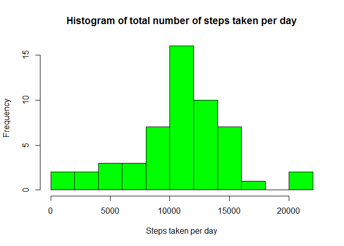

# Reproducible Research: Peer Assessment 1


## Loading and preprocessing the data


```r
library(dplyr)
library(tidyr)
```
Reading the data

```r
act <- read.csv("activity.csv")
act <- tbl_df(act)
act
```

```
## Source: local data frame [17,568 x 3]
## 
##    steps       date interval
##    (int)     (fctr)    (int)
## 1     NA 2012-10-01        0
## 2     NA 2012-10-01        5
## 3     NA 2012-10-01       10
## 4     NA 2012-10-01       15
## 5     NA 2012-10-01       20
## 6     NA 2012-10-01       25
## 7     NA 2012-10-01       30
## 8     NA 2012-10-01       35
## 9     NA 2012-10-01       40
## 10    NA 2012-10-01       45
## ..   ...        ...      ...
```

```r
act_date <- act %>%
  group_by(date) %>%
  summarize(steps_day=sum(steps))

act_date
```

```
## Source: local data frame [61 x 2]
## 
##          date steps_day
##        (fctr)     (int)
## 1  2012-10-01        NA
## 2  2012-10-02       126
## 3  2012-10-03     11352
## 4  2012-10-04     12116
## 5  2012-10-05     13294
## 6  2012-10-06     15420
## 7  2012-10-07     11015
## 8  2012-10-08        NA
## 9  2012-10-09     12811
## 10 2012-10-10      9900
## ..        ...       ...
```

Preprocessing: Removing NA's


```r
act2 <- act_date %>%
  filter(!is.na(steps_day)) ## Remove NA values
 
act2  # tbl without NA values
```

```
## Source: local data frame [53 x 2]
## 
##          date steps_day
##        (fctr)     (int)
## 1  2012-10-02       126
## 2  2012-10-03     11352
## 3  2012-10-04     12116
## 4  2012-10-05     13294
## 5  2012-10-06     15420
## 6  2012-10-07     11015
## 7  2012-10-09     12811
## 8  2012-10-10      9900
## 9  2012-10-11     10304
## 10 2012-10-12     17382
## ..        ...       ...
```

## What is mean total number of steps taken per day?


```r
mean(act2$steps_day)
```

```
## [1] 10766.19
```

```r
median(act2$steps_day)
```

```
## [1] 10765
```

```r
hist(act2$steps_day, xlab="Steps taken per day")
```

 


## What is the average daily activity pattern?


```r
act_int <- act %>%
  group_by(interval) %>%
  summarize(mean_steps=mean(steps, na.rm=TRUE))
  
act_int
```

```
## Source: local data frame [288 x 2]
## 
##    interval mean_steps
##       (int)      (dbl)
## 1         0  1.7169811
## 2         5  0.3396226
## 3        10  0.1320755
## 4        15  0.1509434
## 5        20  0.0754717
## 6        25  2.0943396
## 7        30  0.5283019
## 8        35  0.8679245
## 9        40  0.0000000
## 10       45  1.4716981
## ..      ...        ...
```

```r
plot(act_int$interval,act_int$mean_steps,type="l", col="red" )
```

 

```r
filter(act_int, mean_steps==max(mean_steps))
```

```
## Source: local data frame [1 x 2]
## 
##   interval mean_steps
##      (int)      (dbl)
## 1      835   206.1698
```


## Imputing missing values

We are going to use the mean steps per interval, as we calculated in the last question.


```r
act_na <- act %>%
  filter(is.na(steps))
act_nona <- act %>%
  filter(!is.na(steps))

act_na
```

```
## Source: local data frame [2,304 x 3]
## 
##    steps       date interval
##    (int)     (fctr)    (int)
## 1     NA 2012-10-01        0
## 2     NA 2012-10-01        5
## 3     NA 2012-10-01       10
## 4     NA 2012-10-01       15
## 5     NA 2012-10-01       20
## 6     NA 2012-10-01       25
## 7     NA 2012-10-01       30
## 8     NA 2012-10-01       35
## 9     NA 2012-10-01       40
## 10    NA 2012-10-01       45
## ..   ...        ...      ...
```

```r
act_int2 <- act_int %>%
  mutate(steps=as.integer(floor(mean_steps))) %>%
  select(interval,steps)

a <- complete(act_na, fill=act_int2, by=steps)

act3 <- rbind(act_nona, a)
act3 <- arrange(act3,date,interval)

act3 <- act3 %>%
  group_by(date) %>%
  summarize(steps_day=sum(steps))

hist(act3$steps_day, xlab="Steps taken per day",main="Imputing missing values")
```

 


```r
mean(act3$steps_day)
```

```
## [1] 10749.77
```

```r
median(act3$steps_day)
```

```
## [1] 10641
```


## Are there differences in activity patterns between weekdays and weekends?

```r
library(lubridate)
library(lattice)
```


```r
act_days <- act %>%
  filter(!is.na(steps)) %>%
  mutate(Day_of_the_week=as.integer(wday(ymd(date)))) %>%
  mutate(Weekend = ifelse(Day_of_the_week %in% c(6,7), "Weekend", "Weekday"))%>%
  group_by(interval,Weekend) %>%
  mutate(mean_steps=mean(steps, na.rm=TRUE)) %>%
  select(steps,date,Weekend,interval,mean_steps)

act_days
```

```
## Source: local data frame [15,264 x 5]
## Groups: interval, Weekend [576]
## 
##    steps       date Weekend interval mean_steps
##    (int)     (fctr)   (chr)    (int)      (dbl)
## 1      0 2012-10-02 Weekday        0  2.3333333
## 2      0 2012-10-02 Weekday        5  0.4615385
## 3      0 2012-10-02 Weekday       10  0.1794872
## 4      0 2012-10-02 Weekday       15  0.2051282
## 5      0 2012-10-02 Weekday       20  0.1025641
## 6      0 2012-10-02 Weekday       25  2.8461538
## 7      0 2012-10-02 Weekday       30  0.7179487
## 8      0 2012-10-02 Weekday       35  1.1794872
## 9      0 2012-10-02 Weekday       40  0.0000000
## 10     0 2012-10-02 Weekday       45  1.8461538
## ..   ...        ...     ...      ...        ...
```

```r
xyplot(mean_steps ~ interval | Weekend, act_days, type = "l", layout = c(1, 2), xlab = "Interval", ylab = "Number of steps")
```

 
